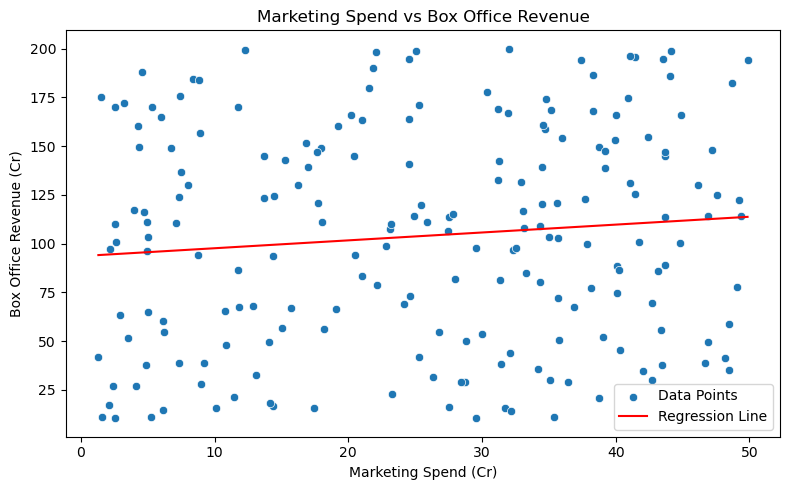

# 🎬 Box Office Revenue Predictor  

This project predicts **movie box office revenue** based on **marketing spend** using Machine Learning.  
A film studio wants to estimate revenue by analyzing historical data from previous movies and applying predictive models.  

---

## 📌 Project Overview  

- Dataset: `regression_datasets_large.xlsx - Movie_Revenue.csv`  
- Goal: Predict **Box Office Revenue** from **Marketing Spend**.  
- Performed **Exploratory Data Analysis (EDA)** to understand relationships.  
- Applied **Linear Regression** to build a predictive model.  
- Visualized the regression line and evaluated model performance.  

---

## ⚙️ Requirements  

Make sure you have the following installed:  

- Python 3.8+  
- Jupyter Notebook / JupyterLab  

Install the dependencies:  

```bash
pip install -r requirements.txt
```

Typical packages used in this project include:  
- numpy  
- pandas  
- matplotlib  
- seaborn  
- scikit-learn  

---

## 🛠 Installation & Setup  

1. Clone this repository:  
   ```bash
   git clone https://github.com/Gokul-bit165/boxoffice-predictor.git
   cd boxoffice-predictor
   ```

2. Install dependencies:  
   ```bash
   pip install -r requirements.txt
   ```

3. Run the notebook:  
   ```bash
   jupyter notebook boxoffice_rev.ipynb
   ```

---

## 📊 Outcomes  

- Found a **strong correlation** between marketing spend and revenue.  
- Built a **Linear Regression model** to predict revenue.  
- Visualized the regression line showing how spend affects revenue.  
- Model evaluation using R² score indicates how much variance is explained.  

---

## 🖼 Output Images  

📌 Linear Regression Plot:  
  

---

## ✅ Conclusion  
---

A film studio wanted to estimate box office revenue based on marketing spend, using historical data from previous movies.

Using a Linear Regression model, the revenue for a film with a **₹10 crore marketing budget** was predicted as **₹97.64 crores**.

However, the **R² value = 0.011** indicates that the model explains very little variance in revenue.

This shows that while marketing spend does have an effect, it is not sufficient on its own to reliably predict box office success.

Other influential factors include cast popularity, genre, competition, release timing, and audience reception.

Future Scope:

Incorporate more features such as IMDb ratings, genre, release season for better predictions. 

---

## 📂 Repository Structure  

```
MOVIE-BOX-REVENUE/
│── images/
│   └── Linear_regression_plot.png     # Output plot
│── boxoffice_rev.ipynb                # Main Jupyter Notebook
│── regression_datasets_large.xlsx - Movie_Revenue.csv   # Dataset
│── requirements.txt                   # Python dependencies
│── README.md                          # Project documentation
```

---

## 👨‍💻 Author  

**Gokul-bit165**  
